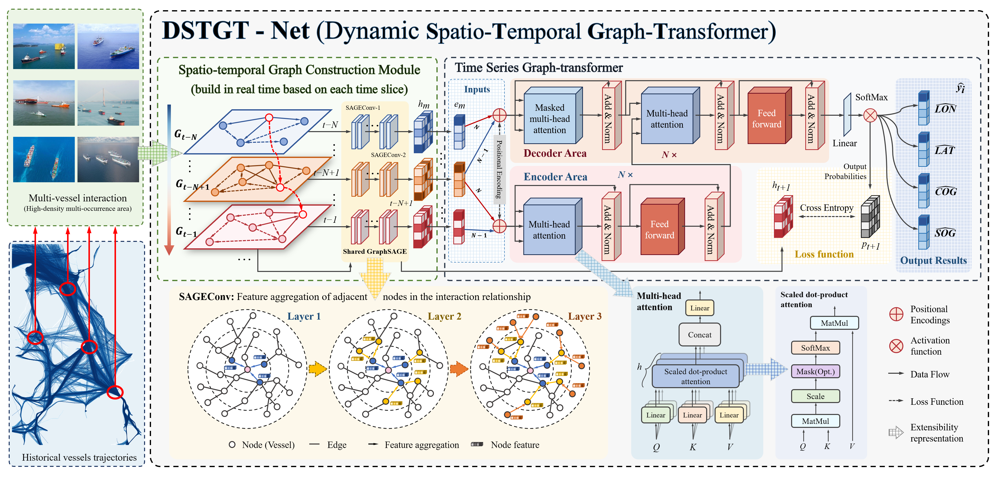

# DSTGT-Net: Inductive Dynamic Spatio-Temporal Graph Transformer for Multi-Vessel Long-Term Trajectory Prediction in High-Density Congested Waterways

[Python](https://www.python.org/) 3.9+ | [PyTorch](https://pytorch.org/) 1.11+ | [License](LICENSE)

> **Paper**: [DSTGT-Net: Inductive Dynamic Spatio-Temporal Graph Transformer for multi-vessel long-term trajectory prediction in high-density congested waterways](https://doi.org/10.1016/j.oceaneng.2026.126534)  
> **Authors**: Jiawen Li, Jiahua Sun, Liang Cao, Tingjun Liu, Ronghui Li  
> **Journal**: Ocean Engineering, 2026

---

## Overview



DSTGT-Net is a novel situational awareness model for autonomous vessels that overcomes two fundamental limitations of existing approaches:

- **Single-vessel temporal modeling** ignores multi-vessel interactions, increasing collision risks in dense waterways.
- **Static graph structures with transductive learning** fail to generalize to unseen dynamic nodes (e.g., new vessels entering the scene).

Our model integrates **inductive graph learning** with a **causal self-attention mechanism** to dynamically capture inter-vessel interactions and long-term motion dependencies. Experimental results on real-world AIS data demonstrate:

- **62.7% reduction** in trajectory prediction error at 5-hour horizon.
- **64.3%** and **43.3%** reductions in speed and course reasoning errors, respectively.
- Superior performance over state-of-the-art methods (TrAISformer, GeoTrackNet, TimeBridge, etc.).

---

## Architecture Overview

DSTGT-Net comprises two cooperative modules:

### 1. Spatio-Temporal Graph Constructor (STGC)
- Dynamically builds vessel interaction graphs based on spatio-temporal correlation thresholds (time interval: 15 min, spatial distance: 1.5 nautical miles).
- Uses **GraphSAGE** (two SAGEConv layers) for inductive neighbor aggregation, enabling generalization to new nodes.
- Outputs node features enriched with neighborhood information.

### 2. Time-Series Graph Transformer (TSGT)
- GPT-like Transformer with masked multi-head self-attention.
- Captures long-range temporal dependencies in trajectory sequences.
- Learnable positional encoding retains temporal order.
- Head network maps hidden states to categorical distributions for LAT, LON, SOG, and COG.

### 3. Multi-Hot Vector Encoding
- Encodes the vessel's own attributes (LAT, LON, SOG, COG) **and** an arbitrary number of neighbors into a single sparse vector.
- Preserves topological interaction information more effectively than one-hot or four-hot encodings.

### 4. Learnable Fuzzy Loss
- Applies 1D Gaussian blur convolution to soften the Softmax probability distribution.
- Mitigates quantization errors from discretization, prevents overfitting, and improves training stability.
- Supports both fixed and learnable blur kernels.

**Overall Workflow** (simplified):

```
AIS Historical Data (LAT, LON, SOG, COG)
        │
        ▼
┌────────────────────────────────────────┐
│  STGC Module                           │
│  - Dynamic graph construction          │
│  - Inductive SAGEConv aggregation      │
└────────────────────────────────────────┘
        │ (node features + adjacency)
        ▼
┌────────────────────────────────────────┐
│  TSGT Module                           │
│  - Multi-hot embedding                 │
│  - Masked self-attention               │
│  - Feed-forward network                │
└────────────────────────────────────────┘
        │ (classification logits)
        ▼
┌────────────────────────────────────────────┐
│  Multi-scale Loss with Fuzzy Smoothing     │
│  L_total = L_fine + ε·L_coarse + η·L_fuzzy │
└────────────────────────────────────────────┘
                      │
                      ▼
   Predicted Trajectory (LAT, LON, SOG, COG)
   and Behavior (Course, Speed)
```

---

## Key Results

### Trajectory Prediction Error (nautical miles)

| Model | 1 h | 2 h | 3 h | 4 h | 5 h |
|-------|-----|-----|-----|-----|-----|
| LSTM-Seq2seq | 8.691 | 10.745 | 13.142 | 15.762 | 18.354 |
| Original Transformer | 5.658 | 8.741 | 12.105 | 15.482 | 18.861 |
| Conv-Seq2seq | 6.099 | 7.910 | 10.182 | 12.732 | 15.115 |
| LSTM-Seq2seq-Att | 3.806 | 6.180 | 8.914 | 11.822 | 14.617 |
| TimeBridge | 1.976 | 3.957 | 6.569 | 9.538 | 13.187 |
| TrAISformer No-Stoch | 1.164 | 2.344 | 3.859 | 5.722 | 7.821 |
| GeoTrackNet | 0.742 | 1.341 | 2.161 | 3.055 | 3.970 |
| **TrAISformer** | 0.480 | 0.833 | 1.300 | 1.882 | 2.507 |
| **DSTGT-Net (Ours)** | **0.249** | **0.393** | **0.556** | **0.741** | **0.936** |

### Behavior Reasoning Error (5-hour horizon)

| Task | Metric | TrAISformer | DSTGT-Net |
|------|--------|-------------|-----------|
| **COG** | MAE (°) | 8.993 | **5.099** |
| | MRE (%) | 16.003 | **10.435** |
| **SOG** | MAE (kt) | 2.798 | **1.000** |
| | MRE (%) | 17.797 | **6.630** |

### Ablation Studies
- **Fuzzy Loss**: Learnable fuzzy loss achieved a training loss of **0.43** (vs. 0.58 for fixed kernel, 0.72 without), confirming its regularizing effect.
- **Multi-Hot Encoding**: Consistently outperformed one-hot and four-hot encodings across all prediction horizons (see Table 6 in the paper).

### Efficiency
- Parameters: 57.34M (only ~7k more than TrAISformer).
- Inference speed: ~32 FPS on GPU for 1-hour prediction, ~5.38 FPS for 5-hour prediction, well above real-time requirements.
- GPU memory usage: ~230 MB.

---

## Getting Started

### Requirements
- Python 3.9+
- PyTorch 1.11+
- Additional packages: see `requirements.txt`

### Data Preparation
- Download the Danish Maritime Authority (DMA) AIS dataset (Q1 2019) and preprocess as described in the paper.
- Place the processed files under `./data/ct_dma/` with names `ct_dma_train.pkl`, `ct_dma_valid.pkl`, `ct_dma_test.pkl`.

### Training
```bash
python run.py --model stgt
```
This uses the default configuration in `config/config_DSTGT.py`.

### Evaluation
```bash
python run.py --model stgt --eval
```
Loads the best checkpoint and reports MAE/MRE.

### Customization
Modify hyperparameters (e.g., spatio-temporal thresholds, fuzzy loss settings) in `config/config_DSTGT.py`.

---

## Project Structure

```
DSTGT-Net-main/
├── config/
│   ├── data/
│   │   ├── ct_dma/                    # Dataset files (placeholder)
│   │   └── graphs/                    # Saved graph structures (placeholder)
│   ├── config_Conv-Seq2seq.py
│   ├── config_DSTGT.py
│   ├── config_GeoTrackNet.py
│   ├── config_LSTM_Seq2seq.py
│   ├── config_LSTM_Seq2seq_att.py
│   ├── config_TimeBridgeais.py
│   ├── config_TrAISformer.py
│   └── config_Transformer.py
├── model/
│   ├── ablation/
│   │   └── ablation_blur.py           # Ablation script for blur loss
│   ├── baselines/
│   │   ├── Conv_Seq2seq.py
│   │   ├── GeoTrackNet.py
│   │   ├── LSTM_Seq2seq.py
│   │   ├── LSTM_Seq2seq_att.py
│   │   ├── TimeBridgeais.py
│   │   ├── TrAISformer.py
│   │   └── Transformer.py
│   ├── Causalself_Att_block.py       # Causal self-attention module
│   ├── DSTGT.py                      # Full DSTGT model integration
│   ├── STGC_block.py                 # Spatio-temporal graph convolution
│   └── TSGT_block.py                 # Temporal encoder component
├── results/
│   ├── checkpoint/
│   │   └── DSTGT_checkpoint.pt
│   ├── error/
│   │   └── error.png
│   ├── figure/                       # Visualization outputs for different routes
│   └── log/
│       └── log_*.log
├── tools/
│   ├── evaluation.py
│   ├── figure.py
│   ├── geo_utils.py                  # Haversine distance, etc.
│   ├── logging_utils.py
│   ├── loss.py                       # Loss function components
│   ├── random_seed.py
│   └── tensor_ops.py                 # Top-k, vicinity masking
├── trainers/
│   ├── dataset.py                    # AISDataset classes
│   ├── sample.py                     # Autoregressive sampling
│   ├── trainer.py                    # Training loop
│   └── utils.py                      # Misc training utilities
├── readme.md                         # This file
├── requirement.txt
└── run.py                            # Main entry point
```

---

## Citation

If you use DSTGT-Net in your research, please cite:

```bibtex
@article{li2026dstgt,
  title={DSTGT-Net: Inductive Dynamic Spatio-Temporal Graph Transformer for multi-vessel long-term trajectory prediction in high-density congested waterways},
  author={Li, Jiawen and Sun, Jiahua and Cao, Liang and Liu, Tingjun and Li, Ronghui},
  journal={Ocean Engineering},
  volume={363},
  pages={126534},
  year={2026},
  doi={10.1016/j.oceaneng.2026.126534}
}
```

---

## Contact

- **Li Jiawen & Sun Jiahua** (maintainers)
- Primary contact: jiawen-li@gdou.edu.cn; sunjiahua@mails.gdut.edu.cn
- For issues, please open a GitHub Issue.

---

## License

This project is licensed under the CECILL-C License. See the `LICENSE` file for details.

---

